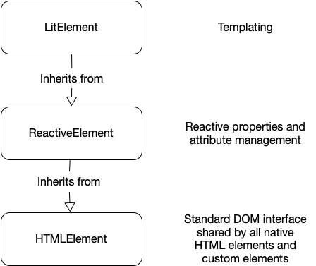

# 定义组件

通过创建继承`LitElement`的类并在浏览器中注册类来定义 Lit 组件:

```ts
@customElement("simple-greeting")
export class SimpleGreeting extends LitElement {/* ... */}
```

`@customElement`修饰器是调用`customElements.define`的简写,它向浏览器注册自定义元素类并将其与元素名称相关联(在本例中为`simple-greeting`)

如果你使用的是 JavaScript,或者如果你没有使用装饰器,你可以直接调用`define()`

```js
export class SimpleGreeting extends LitElement {/* ... */}
customElements.define("simple-greeting", SimpleGreeting);
```

lit组件是 HTML 元素

定义 Lit 组件时,您是在定义自定义 HTML
元素.因此,您可以像使用任何内置元素一样使用新元素

```html
<simple-greeting name="Markup"></simple-greeting>
```

```js
const greeting = document.createElement("simple-greeting");
```

`LitElement`基类是`HTMLElement`的子类,因此 Lit
组件继承所有`HTMLElement`标准属性和方法

具体来说,`LitElemen`继承自`ReactiveElement`
,它实现反应式属性,进而继承自`HTMLElement`



## 提供良好的 TypeScript 推断

TypeScript将根据标记名推断从某些DOM
API返回的HTML元素的类.例如,`document.createElement（'img'）`返回带有`src:string`属性的`HTMLImageElement`实例.

自定义元素可以通过添加到`HTMLElementTagNameMap`来获得相同的处理

```ts
@customElement("my-element")
export class MyElement extends LitElement {
  @property({ type: Number })
  aNumber: number = 5;
  /* ... */
}

declare global {
  interface HTMLElementTagNameMap {
    "my-element": MyElement;
  }
}
```

通过执行此操作,以下代码将正确进行类型检查:

```ts
const myElement = document.createElement("my-element");
myElement.aNumber = 10;
```

建议为TypeScript中编写的所有元素添加一个`HTMLElementTagNameMap`条目,并确保在npm包中公开`.d.ts`类型.
