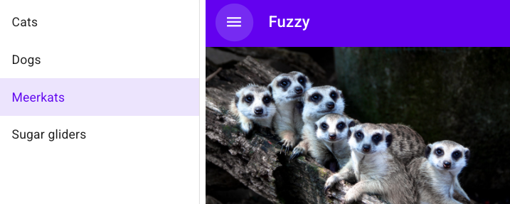
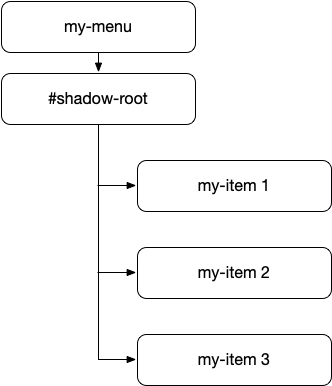

# 组件组成

处理复杂度和将Lit代码分解为独立单元的最常见方法是_component composition_：即,用更小、更简单的组件构建大型、复杂组件的过程.想象一下,您的任务是实现一个UI屏幕：



您可能可以确定需要实现的一些复杂领域.这些可能是组件.
通过将复杂性隔离到特定的组件中,您可以使工作更简单,然后可以将这些组件组合在一起以创建整体设计.

例如,上面这张相当简单的屏幕截图包含了许多可能的组件：一个顶部栏、一个菜单按钮、一个带有用于导航当前部分的菜单项的抽屉；以及主要内容区域.每一个都可以用一个组件表示.一个复杂的组件,比如一个带有导航菜单的抽屉,可能会被分解成许多较小的组件：抽屉本身、一个打开和关闭抽屉的按钮、菜单、单个菜单项.

Lit允许您通过向模板中添加元素来进行组合,无论这些元素是内置HTML元素还是自定义元素.

```js
render() {
  return html`
    <top-bar>
      <icon-button icon="menu" slot="nav-button"></icon-button>
      <span slot="title">Fuzzy</span>
    </top-bar>
    `;
}
```

## 什么是好的组件

在决定如何分解功能时,有几件事有助于确定何时创建新组件.如果以下一个或多个情况适用,则一段 UI 可能是组件的良好候选项:

- 它有自己的状态.
- 它有自己的模板.
- 它用于多个位置,无论是在此组件中还是在多个组件中.
- 它专注于做好一件事.
- 它有一个定义明确的 API.

按钮、复选框和输入字段等可重用控件可以成为出色的组件.但更复杂的 UI 部分（如抽屉和轮播）也是组件化的绝佳候选者

## 上下传递数据

当与子组件交换数据时,一般规则是遵循 DOM 的模型：*属性向下*,*事件向上*.

- 属性下降.在子组件上设置属性通常比在子组件上调用方法更可取.在 Lit 模板和其他声明性模板系统中设置属性很容易.

- 事件上升.在 Web 平台中,触发事件是元素向上发送信息的默认方法,通常是为了响应用户交互.这允许主机组件响应事件,或者为tree上更远的祖先转换或重新触发事件.

此模型的一些含义：

- 组件应该是其影子 DOM 中子组件的真实来源. 子组件不应在其主机组件上设置属性或调用方法.

- 如果组件更改了自身的公共属性,则应触发一个事件以通知tree中更高位置的组件.通常,这些更改将是用户操作的结果,例如按下按钮或选择菜单项.考虑`input`元素,当用户更改输入的值时,它会触发事件.

考虑一个菜单组件,它包含一组菜单项,并将`items`和`selectedItem`属性作为其公共API的一部分公开.其DOM结构可能如下所示：



当用户选择项目时, `my-menu` 元素应更新其`selectedItem`属性.它还应该触发一个事件,通知任何所属组件选择已更改.完整的顺序如下：

- 用户与一个项目进行交互,引发一个事件（要么是像`click`这样的标准事件,要么是特定于`我的项目`组件的某个事件）.

- `my-menu`元素获取事件,并更新其`selectedItem`属性.它还可以更改某些状态,以便突出显示所选项目.

- `my-menu`元素触发一个语义事件,指示选择已更改.例如,此事件可能被称为`selected-item-changed`.由于此事件是`my-menu`API的一部分,因此它在该上下文中应该具有语义意义.

参阅[Events](/docs/components/events/).

## 跨越tree传递数据

属性向下,事件向上是一个很好的规则.但如果您需要在两个没有直接后代关系的组件之间交换数据呢？例如,shadow tree中有两个同级组件？

这个问题的一个解决方案是使用_mediator pattern_.在mediator pattern中,对等组件之间不直接通信.相反,交互由第三方进行.

实现mediator pattern的一种简单方法是让所属组件处理其子级的事件,然后根据需要通过向下传递更改的数据来更新子级的状态.通过添加mediator,您可以使用熟悉的事件向上、属性向下原则在tree中传递数据.

在下面的示例中,调解器元素侦听来自其shadowDOM中的输入和按钮元素的事件.它控制按钮的启用状态,因此当输入中有文本时,用户只能单击**提交**.

[示例](https://lit.dev/playground/#sample=docs/composition/mediator-pattern)

其他mediator pattern包括flux/Redux样式的模式,其中store通过订阅mediator更改和更新组件.让组件直接订阅更改有助于避免每个父级传递其子级所需的所有数据.

## Light DOM 子项

除了shadow DOM中的节点之外,您还可以渲染组件用户提供的子节点,就像标准的`<select>`元素一样.元素可以将一组`<option>`元素作为子节点,并将它们渲染为菜单项.

子节点有时被称为`Light DOM`,以区别于组件的shadowDOM.例如：

```html
<top-bar>
  <icon-button icon="menu" slot="nav-button"></icon-button>
  <span slot="title">Fuzzy</span>
</top-bar>
```

在这里,`top bar`元素有两个由用户提供的浅DOM子元素：一个导航按钮和一个标题.

与Light DOM子对象交互不同于与shadowDOM中的节点交互.组件的影子DOM中的节点由组件管理,不应从组件外部访问.轻DOM子级是从组件外部管理的,但也可以由组件访问.组件的用户可以随时添加或删除轻DOM子节点,因此组件不能采用静态的子节点集.

该组件使用其shadow DOM中的`<slot>`元素来控制是否渲染子节点以及在何处渲染子节点.当通过侦听`slotchange`事件添加和删除子节点时,它可以接收通知.

更多信息请参阅 [rendering children with slots](/docs/components/shadow-dom/#slots) 和 [accessing slotted children](/docs/components/shadow-dom/#accessing-slotted-children).

*猫鼬由 [Anggit Rizkianto](https://unsplash.com/@anggit_mr) 拍摄,来自[Unsplash](https://unsplash.com/photos/x3-OP_X0aH0)*
